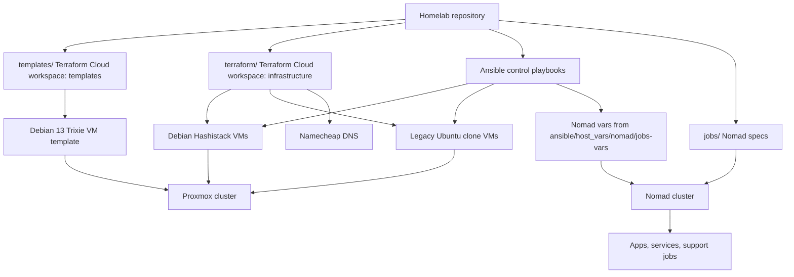

# Securitybits Homelab

[](https://github.com/Securitybits-io/homelab)
[](https://github.com/Securitybits-io/homelab/commits/main)
[](LICENSE)


Infrastructure as code and operational runbooks for the Securitybits homelab. The repository provisions Proxmox VMs with Terraform, configures hosts with Ansible, and runs services through HashiCorp Nomad.

## Current Status

Last documentation refresh: 2026-08-19.

| Area | Status |
| --- | --- |
| Proxmox templates | `templates/` manages a Debian 13 Trixie cloud image, cloud-init snippet, and template VM through the BPG Proxmox provider. |
| Workload VMs | `terraform/` manages infrastructure in Terraform Cloud. Hashistack VMs are on the Debian 13/BPG pattern; `ansible`, `plex`, and private VMs still use the older Telmate Ubuntu clone pattern. |
| Configuration | `ansible/` applies common hardening, SSH, Docker, Consul, Nomad, Vault, Alloy, SMB mounts, Plex, and supporting roles. |
| Scheduling | `jobs/` contains active Nomad job specs split into apps, services, support, and development workloads. |
| Secrets | Nomad variable files are deployed from Ansible host vars. Treat all `*.nv.hcl` and vault files as sensitive unless proven otherwise. |
| Documentation | Operational procedures live in `docs/`, including Terraform lifecycle, provisioning, Nomad operations, secrets handling, architecture, and Plex migration. |

## Repository Stats

| Metric | Count |
| --- | ---: |
| Files | 345 |
| Terraform files | 14 |
| Active Nomad job files | 39 |
| Ansible roles | 16 |
| Ansible YAML files | 95 |
| Nomad variable files | 15 |
| Documentation files | 7 |

## Architecture



## Layout

| Path | Purpose |
| --- | --- |
| `templates/` | Terraform root for base VM templates and cloud-init snippets. |
| `terraform/` | Terraform root for workload VMs and DNS records. |
| `ansible/` | Inventory, playbooks, host vars, roles, and Nomad variable deployment. |
| `jobs/` | Nomad job specifications and job-local env/volume files. |
| `apps/` | Docker Compose and application config retained for app-specific workloads. |
| `docs/` | Architecture notes and operational procedures. |

## Documentation

- [Architecture](docs/architecture.md)
- [Terraform Lifecycle](docs/terraform.md)
- [Ansible Provisioning](docs/ansible.md)
- [Nomad Operations](docs/nomad.md)
- [Secrets Handling](docs/secrets.md)
- [Operational Procedures](docs/operations.md)
- [Plex Media Server Migration](docs/plexmediaserver-migration.md)

## Common Workflows

### Create or Update the Debian 13 Template

Use the template root when changing the base image, template VM, or generic cloud-init snippet.

```bash
cd templates
terraform init
terraform plan
terraform apply
```

The template VM intentionally stays generic. Hostnames, service roles, storage mounts, and application packages belong in workload Terraform or Ansible.

### Manage Workload Infrastructure

Use the workload root for Nomad, Consul, Vault, legacy VMs, and DNS.

```bash
cd terraform
terraform init
terraform plan
terraform apply
```

The workload root currently contains both new BPG Proxmox resources and older Telmate resources. Migrate legacy VMs additively and retire old VMs only after the replacement has been provisioned and verified.

### Bootstrap a Host for Ansible

```bash
cd ansible
ansible-playbook -i production --limit <host> playbooks/provision-ssh-key.yml --ask-vault-pass --user=provision --ask-pass
ansible-playbook -i production --limit <host> site.yml --ask-vault-pass --user=provision --ask-pass
```

### Configure the Nomad Cluster

```bash
cd ansible
ansible-playbook -i production nomad.yml --ask-vault-pass
```

The `nomad.yml` playbook configures servers and clients, copies `jobs/` to `/opt/jobs`, and pushes Nomad variable files with `nomad var put -force`.

## Safety Notes

- Run `terraform plan` before any apply.
- Keep `templates/` and `terraform/` state separate.
- Do not move Terraform state between Telmate and BPG resource types without a deliberate migration plan.
- Treat Namecheap `mode = "OVERWRITE"` as destructive to unmanaged DNS records.
- Do not commit plaintext secrets. Rotate any credential that was committed before the repository is made public.
- Keep stateful app data, such as Plex, separate from VM OS rebuilds.

## Roadmap

### Nomad Apps to Create or Finish

- [x] Authelia
- [ ] Kometa
- [ ] PiHole
- [ ] Umami
- [ ] Papertrail-ng
- [x] Reverse proxy with Traefik
- [x] Ombi
- [ ] Guacamole
- [ ] Kavita Reader
- [ ] Plausible
- [ ] EmulatorJS
- [ ] SocioBoard
- [x] Wazuh
- [x] Immich photo backup
- [ ] Shlink
- [ ] Taskwarrior
- [ ] ActivityWatch
- [ ] Uptime Kuma
- [x] Microbin
