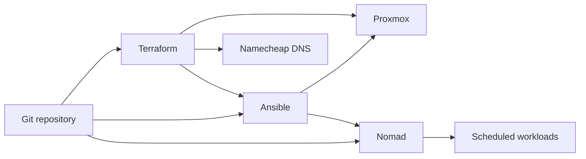

# Homelab Architecture

This document describes the current repository architecture and how the major systems relate to each other.

## Control Plane

The homelab is managed from this repository through three layers:

1. Terraform creates and updates Proxmox virtual machines and DNS records.
2. Ansible configures operating systems, runtime packages, HashiCorp agents, and supporting services.
3. Nomad schedules application, service, support, and development workloads.

## Terraform Roots

The repository intentionally keeps template infrastructure and workload infrastructure in separate Terraform roots.

| Root | Terraform Cloud workspace | Provider pattern | Ownership |
| --- | --- | --- | --- |
| `templates/` | `templates` | `bpg/proxmox` as `proxmox` | Debian 13 cloud image import, cloud-init snippet, and reusable template VM. |
| `terraform/` | `infrastructure` | mixed `bpg/proxmox`, Telmate Proxmox, and Namecheap | Workload VMs and DNS records. |

The `templates/` root owns VM template ID `9000` named `debian-13-trixie-template`. Workload resources clone from that template when using the Debian 13 pattern.

## VM Status

| VM group | Current pattern | Notes |
| --- | --- | --- |
| Nomad VMs | BPG Proxmox, Debian 13 clone, `for_each` in `terraform/nomad.tf` | Data-driven map with CPU, memory, disk, VLAN, MAC, description, and tags. |
| Consul and Vault | BPG Proxmox, Debian 13 clone | Separate resources using the same template clone pattern. |
| Ansible, Plex, private Docker, private YTDL | Telmate Proxmox, Ubuntu template clone | Legacy resources pending additive migration. |

Do not imply a legacy VM has migrated until the new VM has been created, provisioned, service data has been migrated, and the old VM has been retired.

## Runtime Layout

Nomad jobs are organized by intent:

| Path | Purpose |
| --- | --- |
| `jobs/hashilab-apps/` | User-facing and media/application workloads. |
| `jobs/hashilab-services/` | Shared platform services such as ingress, observability, auth, and databases. |
| `jobs/hashilab-support/` | Maintenance, support, CSI, and update jobs. |
| `jobs/hashilab-dev/` | Development and experimental workloads. |

Ansible deploys job files to `/opt/jobs` on the Nomad server and pushes Nomad variable files from `ansible/host_vars/nomad/jobs-vars`.

## Network and DNS

VMs generally attach to `vmbr0` and use VLAN IDs defined in Terraform resources. Namecheap records for `securitybits.io` are managed in `terraform/dns.tf`.

The DNS resource uses overwrite mode. Before changing DNS records, compare the desired state against any records managed outside Terraform.

## Documentation Map

- Terraform state, plan, and migration rules: [Terraform Lifecycle](terraform.md)
- Host provisioning and inventory flow: [Ansible Provisioning](ansible.md)
- Job deployment and troubleshooting: [Nomad Operations](nomad.md)
- Secret handling and migration cautions: [Secrets Handling](secrets.md)
- Common runbooks: [Operational Procedures](operations.md)
- Plex state migration: [Plex Media Server Migration](plexmediaserver-migration.md)
